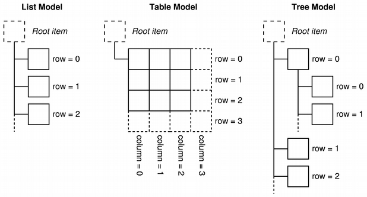

TeamGenerator_GUI module
========================
Das Module **TeamGenerator_GUI** erzeugt das GUI (Graphical User Interface) für den **Mannschaftsgenerator**.
Es wird PyQt4 benutzt. Das ist eine Qt4 Implementierung für Python3.

Das Programm hat verschiedene Windows:

1. Die Windows
--------------

	
	Windows aus main::
	
		 #: Needed to start Qt
		app = QtGui.QApplication(sys.argv)
		
		#: Now loading the Qt Designer ".ui"-files and instanciating the user interfaces:
		welcomeWindow =         uic.loadUi('./.GUI/welcomeWindow.ui')
		playerSelectWindow =    uic.loadUi('./.GUI/playerSelectWindow.ui')
		waitingCalculation =    uic.loadUi('./.GUI/waitingCalculation.ui')    
		calculatedTeamWindow =  uic.loadUi('./.GUI/calculatedTeamWindow.ui')   
		
		
		#: To setup all the Qt models and Views of for each window one class is instanciated
		wcwin = welcomeWind()
		ctwin = calculateTeamWind(tgmA, tgmB)
		waitwin = waitingCalculationWind()
		pswin = playerSelectWind()

Es werden QWidgets mit dem QT Designer gemacht und mit uic.loadUi geladen.

Für weitere Informationen siehe:
http://pyqt.sourceforge.net/Docs/PyQt4/qwidget.html#details

http://pyqt.sourceforge.net/Docs/PyQt4/qmainwindow.html#details
		
1.1 welcomeWindow
^^^^^^^^^^^^^^^^^
.. image:: welcomeWindow.jpg

1.2 playerSelectWindow
^^^^^^^^^^^^^^^^^
.. image:: playerSelectWindow.jpg

1.3 waitingCalculation
^^^^^^^^^^^^^^^^^^^^

1.4 calculatedTeamWindow
^^^^^^^^^^^^^^^^^^^^^^^^
.. image:: calculatedTeamWindow.jpg
=============================	=============================================================================================
Untermenü						Funktion
=============================	=============================================================================================
-Datei-  -Speichern-			generiert ein *json file mit den generierten Manschaften in .\Result (TeamA.json; TeamB.json)
-Datei-  -Speichern unter-   	generiert ein *json file mit den generierten Manschaften
-Datei-  -print to *txt-   		generiert ein *txt file mit den generierten Manschaften
=============================	=============================================================================================

Qt Model-View-Programming
=========================

http://doc.qt.io/qt-4.8/model-view-programming.html

Model
-----
Das Model ist die Schnittstelle über die ein View auf die Daten zugreift. Die Daten gehören nicht zum Model sondern zu einer anderen Klasse.
Wenn man die Daten in einer Tabelle darstellen will benutzt man am besten das **QAbstractTableModel**.
Ein **Team** hat ja eine Liste von playern und die sollen  immer in einer Tabelle aufgelistet werden.
Das Model heist ``TeamGeneratorModel`` und implementiert ``QtCore.QAbstractTableModel``.

Das Model regelt also wie und welche Daten im View dargestellt werden. Dazu muss mann verschiedene Methoden implementieren die vom View benutzt werden.
  
View
----
Für die Darstellung der Daten in Tabellen Form wird ein ``QTableView`` implementiert.  

http://pyqt.sourceforge.net/Docs/PyQt4/qtableview.html

Proxy model
-----------
Für einen View ist ein Proxy model Objekt das gleiche wie ein Model. Der View kann über ein oder viele Proxy model auf das Grundmodel und darüber auf die die Daten zugreifen.
``QtGui.QSortFilterProxyModel`` ist ein solches ProxyModel das verschiedene Sortierungen bereitstellt.

	
Table der verschiedenen benutzten Fälle:

	================= ====== ========= ===== ======== ====== ==============
	data              <-->   model     <-->  proxy    <-->   view
	================= ====== ========= ===== ======== ====== ==============
	fullTeam.players  <-->   tgmF      <-->  proxyF   <-->   tableView_full  
	teamA.players     <-->   tgmA      <-->  proxyA   <-->   tableView_A
	teamB.players     <-->   tgmB      <-->  proxyB   <-->   tableView_B
	================= ====== ========= ===== ======== ====== ==============

Gesammt sieht das dann zum Beispiel so aus::

		#: Data of teamA.players is connected with the View tableView_A
        #: in three steps: 
        
		#: teamA.players <--> tgmA
        tgmA.ptableUpdate(tg.teamA.players)
        proxyA = PlayerFilterProxyModel(tgmA)
        
		#: teamA.players <--> tgmA <--> proxyA
        proxyA.setSourceModel(tgmA)
        
		#: teamA.players <--> tgmA <--> proxyA <--> tableView_A
        playerSelectWindow.tableView_A.setModel(proxyA)
		
		
		

http://doc.qt.io/qt-4.8/images/modelview-models.png	

2. Qt 
-----

	

 Die Daten [tg.fullTeam.players] sind mit dem Daten Model [TeamGeneratorModel] verbunden und das Daten Model ist mit dem View [QtableView] verbunden.
	Daten <------> Model <------> View
 	Daten <------> Model <------> Proxy <----> , ... , Proxy <----> View
 
 
Das Model regelt wie und welche Daten im View dargestellt werden. Dazu muss mann verschiedene Methoden implementieren die vom View benutzt werden.

Was Anderes
===========

	
.. automodule:: TeamGenerator_GUI
    :members:
    :undoc-members:
    :show-inheritance:

	py:function:: enumerate(sequence[, start=0])